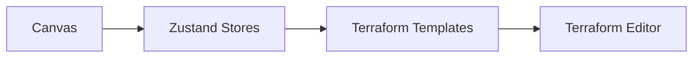
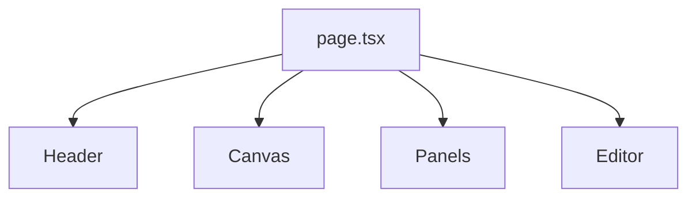
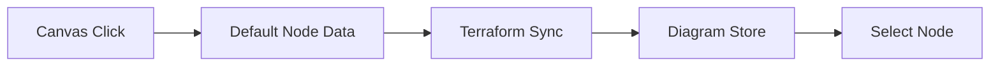
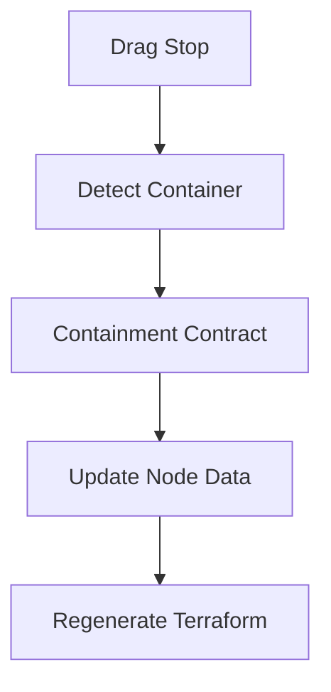
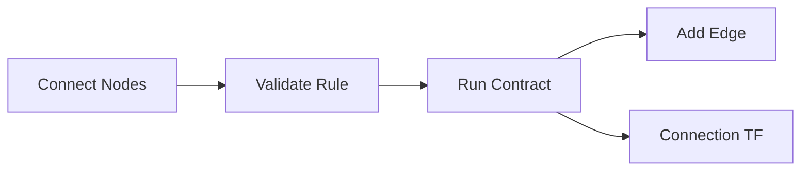
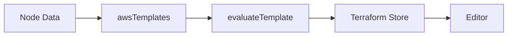
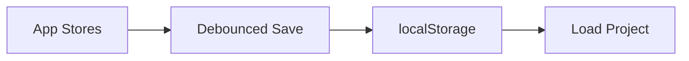
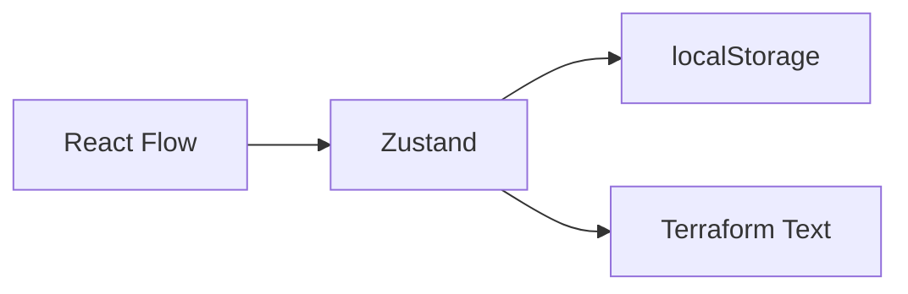

# CloudSketch Current System

This folder documents how the app works today. It intentionally ignores the long-term vision, roadmap, business plan, and market reports.

## What This App Does

CloudSketch is a Next.js app where users place AWS resources on a React Flow canvas, connect them, configure them, and see Terraform generated from the current canvas state.

Main files:

- `src/app/page.tsx` - main app screen layout.
- `src/components/Canvas.tsx` - React Flow canvas setup.
- `src/store/useDiagramStore.ts` - nodes, edges, selection, layout, delete logic.
- `src/utils/terraformSync.ts` - compiles a node into Terraform.
- `src/lib/templateEvaluator.ts` - custom template evaluator.
- `src/components/Editor.tsx` - Terraform editor panel.

## App Shell

The first screen is assembled in `src/app/page.tsx`.

It renders:

- `Header`
- `Sidebar`
- `Canvas`
- settings panels
- config panel
- Terraform editor

References:

- `src/app/page.tsx`
- `src/components/Header.tsx`
- `src/components/Sidebar.tsx`
- `src/components/Canvas.tsx`
- `src/components/ConfigPanel.tsx`
- `src/components/SettingsPannel/NodeSettingsPanel.tsx`
- `src/components/SettingsPannel/ResourceSettingsPanel.tsx`
- `src/components/Editor.tsx`

## Canvas State

The canvas state lives mostly in `useDiagramStore`.

It stores:

- `nodes`
- `edges`
- selected node IDs
- selected edge IDs
- current tool
- open settings node
- delete modal state

It also handles:

- adding nodes
- adding edges
- deleting nodes and child nodes
- updating node data
- updating node dimensions
- updating node position
- keeping parent nodes before children for React Flow
- VPC/subnet layout behavior

References:

- `src/store/useDiagramStore.ts`
- `src/components/Canvas.tsx`
- `src/components/Canvas/useCanvasDragAndDrop.ts`
- `src/components/Canvas/useCanvasConnection.ts`
- `src/components/Canvas/nodeTypes.tsx`

## Adding A Node

When a tool is selected and the user clicks the canvas, `Canvas.tsx` creates a node, generates default data for that node type, compiles Terraform for it, adds it to the diagram store, and selects it.

References:

- `src/components/Canvas.tsx`
- `src/components/Canvas/nodeTypes.tsx`
- `src/utils/terraformSync.ts`
- `src/store/useDiagramStore.ts`

## Node Types And Defaults

React Flow node components are registered in `src/components/Canvas/nodeTypes.tsx`.

Current node types include:

- `ec2`
- `rds`
- `s3`
- `ebs`
- `vpc`
- `subnet`
- `elb`
- `lambda`
- drawing tools like `rectangle`, `circle`, `rhombus`, `text`

Default data for each node type is returned by `getDefaultDataForNode`.

References:

- `src/components/Canvas/nodeTypes.tsx`
- `src/components/nodes/awsNodes/EC2Node.tsx`
- `src/components/nodes/awsNodes/RDSNode.tsx`
- `src/components/nodes/awsNodes/S3Node.tsx`
- `src/components/nodes/awsNodes/EBSNode.tsx`
- `src/components/nodes/awsNodes/VPCNode.tsx`
- `src/components/nodes/awsNodes/SubnetNode.tsx`
- `src/components/nodes/awsNodes/ELBNode.tsx`

## Drag, Drop, And Nesting

Dragging is handled by `useCanvasDragAndDrop`.

Current nesting behavior:

- subnets can be dropped into VPCs
- EC2, RDS, and ELB can be dropped into subnets
- entering a container updates node data
- leaving a container clears related data

References:

- `src/components/Canvas/useCanvasDragAndDrop.ts`
- `src/lib/graphProtocol/ugcp.ts`
- `src/lib/graphProtocol/contractRegistry.ts`
- `src/store/useDiagramStore.ts`
- `src/utils/terraformSync.ts`

## Connections

Connections are handled by `useCanvasConnection`.

Before an edge is added:

- source and target nodes must exist
- the nodes cannot already be connected
- `canConnect` must allow the source/target type pair
- graph contracts can update node data or create connection Terraform

Examples:

- EC2 to EBS creates an EBS attachment Terraform block.
- EC2 to S3 creates connection-related Terraform.
- ELB to EC2 creates target attachment Terraform.

References:

- `src/components/Canvas/useCanvasConnection.ts`
- `src/config/connectionsConfig.ts`
- `src/lib/graphProtocol/ugcp.ts`
- `src/lib/graphProtocol/contractRegistry.ts`
- `src/utils/connectionUtils.ts`
- `src/store/useTerraformStore.ts`

## Terraform Generation

Terraform generation is client-side.

`syncNodeWithBackend` does not actually call a backend right now. It:

- receives a node ID, type, and data
- finds a template in `awsTemplates`
- evaluates the template using `evaluateTemplate`
- writes the result into `useTerraformStore`

References:

- `src/utils/terraformSync.ts`
- `src/registry/awsTemplates.ts`
- `src/lib/templateEvaluator.ts`
- `src/store/useTerraformStore.ts`
- `src/components/Editor.tsx`
- `src/templates/aws/`

## Terraform Store

`useTerraformStore` stores generated Terraform blocks in a record keyed by node ID or edge ID.

It supports:

- setting all blocks
- appending blocks
- updating one block
- deleting one block
- clearing all blocks
- joining all blocks as one string

References:

- `src/store/useTerraformStore.ts`

## Resource Store

`useTerraformResourceStore` stores global Terraform resources that are not always visible as canvas nodes.

Examples include:

- IAM roles
- key pairs
- security groups
- instance profiles

References:

- `src/store/useTerraformResourceStore.ts`
- `src/config/resources/iam.config.ts`
- `src/config/resources/keypair.config.ts`
- `src/config/resources/sg.config.ts`
- `src/config/resources/instanceprofile.config.ts`

## Project Persistence

Project persistence currently uses browser `localStorage`.

`useProjectStore` saves:

- project metadata
- nodes
- edges
- resource store data
- Terraform blocks

It also auto-saves with a debounce after diagram, resource, or Terraform store changes.

References:

- `src/store/useProjectStore.ts`
- `src/store/useDiagramStore.ts`
- `src/store/useTerraformResourceStore.ts`
- `src/store/useTerraformStore.ts`

## AI Prompt Flow

The AI route exists, but it is still basic.

If Groq environment variables are missing, it returns a mock graph. If they are set, it proxies the prompt to the configured Groq endpoint and expects a graph-shaped JSON response.

The current parser normalizes loose graph JSON into a simpler node/edge shape.

References:

- `AI_PROMPT.md`
- `src/components/AIConsole.tsx`
- `src/lib/aiClient.ts`
- `src/app/api/ai/prompt/route.ts`
- `src/lib/ai/parseUGCP.ts`

## Config And Templates

To add or modify supported AWS behavior, these are the main places:

- `src/components/Canvas/nodeTypes.tsx` - register the visual node component and default data.
- `src/config/awsNodes/` - node config data.
- `src/config/resources/` - non-canvas resource config data.
- `src/config/connectionsConfig.ts` - allowed connection rules.
- `src/lib/graphProtocol/contractRegistry.ts` - side effects of nesting and connecting.
- `src/registry/awsTemplates.ts` - active in-memory Terraform templates.
- `src/templates/aws/` - `.tf.tmpl` template files kept in the repo.
- `src/registry/nodeRegistry.ts` - metadata that maps node types to template paths.

## Important Current Reality

The current working app is mostly:

MongoDB and the larger graph-first system are not the main active persistence path yet.

References:

- `src/lib/mongodb.ts`
- `src/models/userSchema.ts`
- `src/store/useProjectStore.ts`
- `src/lib/graphProtocol/`
