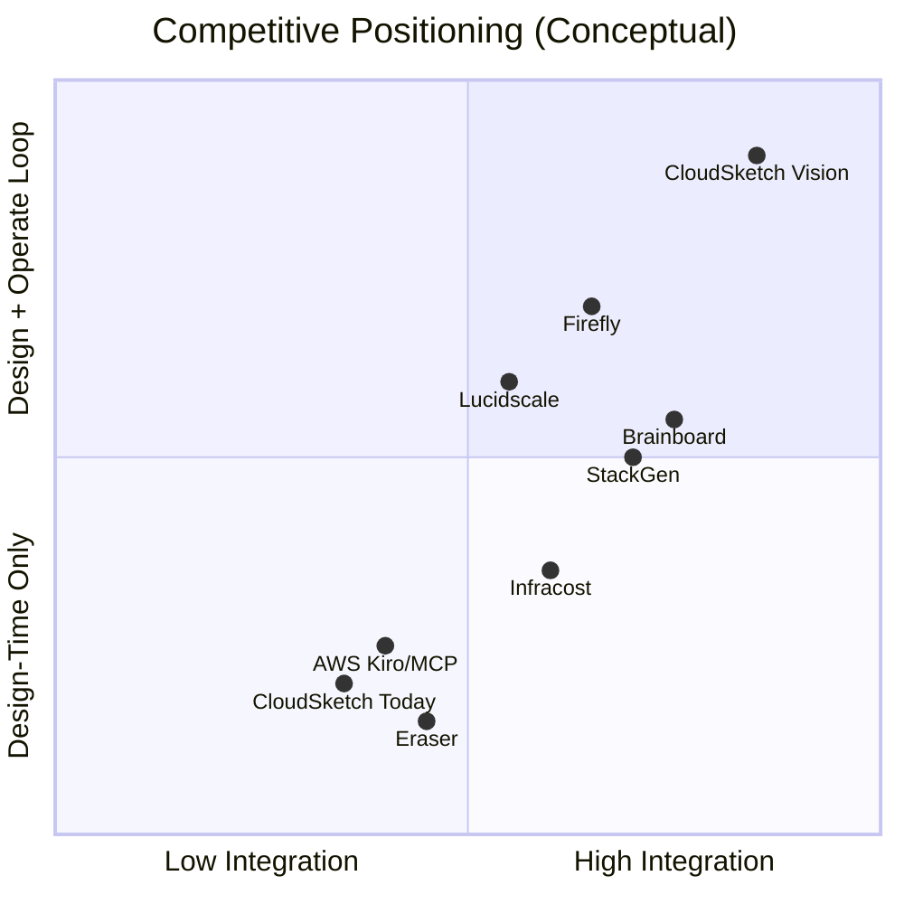

# CloudSketch Deep Market & Innovation Research

**Verdict upfront:** The *problem* CloudSketch targets is real, expensive, and growing. The *full vision* is directionally right but **not novel as a headline** — several funded players are already executing overlapping pieces. Where CloudSketch can still win is by **not competing as "another diagram → Terraform tool"** and instead owning **infrastructure reasoning** (why, what-if, validate, simulate) on top of a canonical graph. Today, that moat does not exist yet; [Brainboard](https://www.brainboard.co/) and others are years ahead on execution.

---

## 1. How Innovative Is This Idea?

### Innovation Scorecard

| Dimension | Score (1–10) | Assessment |
|-----------|-------------|------------|
| **Problem identification** | 9 | Fragmentation across docs, diagrams, IaC, security, cost is widely felt |
| **Vision ambition** | 8 | "Infrastructure OS" is compelling category language |
| **Current product novelty** | 4 | Visual AWS canvas + live TF is already a crowded lane |
| **Technical approach (UGCP graph)** | 7 | Graph-as-source-of-truth is the right architecture *if* executed rigorously |
| **Full-platform differentiation** | 6–7 | Reasoning + failure sim + doc ingestion + digital twin *together* is rare |
| **Defensibility today** | 3 | Early codebase, no brand, no enterprise logos, Brainboard/StackGen ahead |
| **Timing (AI + platform engineering)** | 8 | AI-native design and "shift-left everything" are hot |

### The Honest Innovation Frame

CloudSketch is **not** innovative if judged as:

> "Draw cloud diagrams that generate Terraform"

That lane has existed for years and is now being accelerated by AI.

CloudSketch **is** potentially innovative if judged as:

> "A queryable, collaborative infrastructure graph that explains decisions, validates continuously, simulates failures, and stays synced from requirements → design → deploy → runtime"

**No major player owns that full loop today.** But many own *slices* of it, and the slices are the hard part.

---

## 2. Market Validation — Is the Pain Real?

**Yes.** Multiple independent signals confirm demand:

| Signal | Evidence |
|--------|----------|
| **IaC market growth** | Infrastructure-as-Code market estimated at ~$1.5B+ (2024) growing ~15–22% CAGR ([Grand View Research](https://www.grandviewresearch.com/industry-analysis/infrastructure-as-code-market-report), [Fortune Business Insights](https://www.fortunebusinessinsights.com/infrastructure-as-code-market-108777)) |
| **"Shift left" FinOps works** | [Infracost](https://www.infracost.io/) raised $15M Series A (Nov 2025), claims 3,500+ companies including ~10% of Fortune 500 — proves engineers will adopt design-time cloud intelligence *when it fits their workflow* |
| **Deploy/governance has big money** | [Spacelift](https://spacelift.io/) raised $51M Series C (2025) for enterprise IaC automation — budgets exist for infra platforms |
| **Visual + IaC is actively funded** | [StackGen + HashiCorp partnership](https://stackgen.com/blog/stackgen-hcp-terraform-integration) (Sep 2025) — visual design → HCP Terraform with security validation |
| **Cloud giants investing** | AWS [Kiro CLI + Diagram MCP](https://aws.amazon.com/blogs/machine-learning/build-aws-architecture-diagrams-using-amazon-q-cli-and-mcp/) generates architecture diagrams from natural language; [Infrastructure Composer](https://aws.amazon.com/infrastructure-composer/) for serverless visual IaC |
| **M&A validates diagram value** | Datadog acquired [Cloudcraft](https://www.datadoghq.com/blog/datadog-acquires-cloudcraft/) to merge live diagrams with observability — architecture visualization is strategic, not trivial |

**Implication:** The market pays for infrastructure intelligence. CloudSketch's bet that *all* intelligence (not just cost or just deploy) should live in one graph is logical — but unproven at platform scale.

---

## 3. Competitive Landscape — Who Already Does What?

### Tier 1: Direct Threats (Closest to CloudSketch Vision)

| Company | What they do | Overlap with CloudSketch | Gap vs. full vision |
|---------|--------------|--------------------------|---------------------|
| **[Brainboard](https://www.brainboard.co/)** | Visual multi-cloud designer, real-time TF/OpenTofu, collaboration, drift detection, AI diagrammer, cost/security "built in", enterprise customers (Figma, Notion, DuPont, Deloitte) | **~70–80% overlap** on near-term roadmap | Weak on deep reasoning ("why?"), failure propagation simulation, requirements doc ingestion |
| **[StackGen](https://stackgen.com/)** | Visual AppStacks → hardened Terraform → HCP Terraform; HashiCorp partner; security validation at design time | **~60% overlap** on design → deploy | Less AI-native; not positioned as reasoning/simulation platform |
| **[Eraser](https://www.eraser.io/)** | AI diagram from Terraform/code; Fortune 500 logos; diagram-as-code | **~40% overlap** on AI + diagrams | Reverse direction (code → diagram), not full design-to-deploy loop |

**Critical finding:** Brainboard's homepage literally says *"The cloud is your canvas. Design, deploy and manage your cloud infrastructure from end-to-end"* with collaborative cursors, multi-cloud, Terraform, drift, and AI. This is the closest direct competitor and they have enterprise traction CloudSketch does not.

### Tier 2: Adjacent Players (Own a Slice)

| Company | Slice owned | Threat level |
|---------|-------------|--------------|
| **[Infracost](https://www.infracost.io/)** | Cost at PR/design time, AutoFix, Issue Explorer | High for cost intelligence wedge; could expand |
| **[Firefly](https://www.firefly.ai/)** | Cloud asset management, codify, drift remediation | High for digital twin / drift long-term |
| **[Lucidscale](https://lucid.co/lucidscale)** | Live cloud inventory → auto diagrams (AWS/Azure/GCP) | High for enterprise architecture review |
| **[Cloudcraft](https://www.cloudcraft.co/)** (Datadog) | Live AWS/Azure diagrams, cost, auto-update from cloud | High for runtime-linked diagrams |
| **[Spacelift](https://spacelift.io/)** / **[env0](https://www.env0.com/)** | Deploy, policy, drift, CI/CD for IaC | High if CloudSketch adds deploy — they own this lane |
| **[Pluralith](https://www.pluralith.com/)** | Terraform visualization | Low–medium |
| **AWS native tools** | Composer, Kiro CLI, Diagram MCP, Well-Architected | **Existential** for AWS-only SMB segment — free/cheap |

### Tier 3: AI Commoditization Risk

AWS now lets architects generate professional diagrams via **natural language + MCP** in minutes, grounded in AWS documentation. That commoditizes:

- AI architecture generation
- AWS icon correctness
- Basic best-practice alignment

CloudSketch cannot win on "AI draws a diagram" alone. The free AWS tooling will get better every quarter.

---

## 4. Feature-by-Feature: Vision vs. Market

| CloudSketch Vision Capability | Market status | Innovation level |
|------------------------------|---------------|------------------|
| 1. AI-powered design | **Crowded** — Brainboard, Eraser, AWS Kiro/MCP, SketchTF, Terravision | Low differentiation alone |
| 2. Interactive visual design | **Mature** — Brainboard, Cloudcraft, Lucidscale, draw.io | Low |
| 3. Real-time collaboration | **Partially solved** — Brainboard, Figma-like UX expected | Medium (table stakes) |
| 4. Knowledge ingestion (RFCs, TF, K8s) | **Emerging** — Firefly (codify), Brainboard (import), StackGen (tfstate import) | Medium–High if done deeply |
| 5. Reasoning engine ("why?") | **Mostly unsolved** — no clear market leader | **High — best differentiation bet** |
| 6. Architecture validation | **Fragmented** — Checkov, Snyk, Bridgecrew, StackGen design-time checks | Medium (integration play) |
| 7. Cost intelligence | **Strong incumbent** — Infracost dominates "shift-left cost" | Low unless differentiated |
| 8. Capacity / scale analysis | **Niche** — some APM/capacity tools, not graph-native | Medium–High |
| 9. Failure simulation | **Rare on architecture graphs** — chaos engineering is runtime, not design-time | **High — differentiated if real** |
| 10. Optimization recommendations | **Partial** — Infracost AutoFix, AWS WA Tool | Medium |
| 11. Terraform generation | **Solved** — Brainboard, StackGen, many others | Low |
| 12. Deployment automation | **Owned by Spacelift/env0/TFC** | Low — partner don't build |
| 13. Digital twin | **Emerging** — Firefly, Lucidscale, Cloudcraft+Datadog | Medium — hard to execute |

---

## 5. What Could WIN

### Wedge 1: Infrastructure Reasoning Engine (Strongest bet)

Nobody credibly answers:

- *"Why is this DB in a private subnet?"*
- *"What are the alternatives and tradeoffs?"*
- *"What requirement drove this decision?"*

If CloudSketch stores **provenance** on every graph node (requirement link, AI rationale, human override, pattern reference), it becomes a **queryable knowledge system** — not a drawing tool. That is genuinely new.

### Wedge 2: Design-Time Failure Simulation

Chaos engineering (Gremlin, Litmus) runs against **deployed** systems. Simulating *"what if Redis dies?"* on the **architecture graph** before deploy is rare. If visualization of blast radius is compelling, this is a strong enterprise sales hook for architects and SREs.

### Wedge 3: Requirements → Graph Ingestion

Connecting RFCs, Confluence docs, and existing Terraform into one living graph with organizational constraints is hard and valuable. Platform teams drowning in brownfield infra would pay for this.

### Wedge 4: Graph Protocol (UGCP) as Open Standard

If UGCP becomes an open, extensible infrastructure graph format (like "LLVM IR for cloud architecture"), ecosystem players integrate rather than compete. Long shot but high upside.

### Wedge 5: UX + Speed for a Specific ICP

Win a narrow segment first:

- **Series A–C SaaS on AWS** (20–80 engineers)
- **Consultancies / SIs** designing client architectures
- **Cloud training / certification** market

Out-execute Brainboard on **time-to-first-valid-Terraform** and **AI edit quality**, not feature breadth.

### Wedge 6: Integration-First (Don't Fight Spacelift)

Generate graph + Terraform + validation, then **push to GitHub + Terraform Cloud**. Become the *design brain*; let incumbents handle deploy. Reduces build scope and sales friction.

---

## 6. What Could FAIL

### Failure Mode 1: "Just Another Diagram Tool"

If the market perceives CloudSketch as Lucidchart + Terraform export, you lose on:

- Brand (Brainboard, Eraser have years of presence)
- Enterprise trust (SOC 2, references)
- Free alternatives (draw.io, AWS MCP)

**Probability: High** if positioning stays generic.

### Failure Mode 2: Visual IaC Cultural Resistance

A recurring industry theme: **developers trust code, not canvases.** Visual multi-cloud IaC tools have struggled for mass adoption (community discussions like [r/Cloud on visual IaC adoption](https://www.reddit.com/r/Cloud/comments/1rip6hh/why_havent_visual_multicloud_iac_tools_taken_off/) reflect skepticism).

Senior DevOps engineers often:

- Distrust generated Terraform
- Want Git as source of truth, not a SaaS canvas
- Prefer modules + code review over drag-and-drop

**Probability: Medium–High** unless CloudSketch embraces Git-first workflows.

### Failure Mode 3: Building Too Much, Too Fast

The vision has **13 major capabilities**. Building all of them before PMF is a classic startup killer. Brainboard has been at this for years with a larger team.

**Probability: High** without ruthless sequencing (your roadmap helps, but execution discipline matters more).

### Failure Mode 4: AI Trust & Liability

AI-generated architectures can:

- Expose databases publicly
- Over-provision expensive resources
- Miss compliance requirements

One bad generated architecture in production → reputational damage.

**Probability: Medium** — mitigated by validation engine, but validation must be excellent.

### Failure Mode 5: Incumbent Bundling

- **AWS** gives away diagram + IaC tooling
- **Datadog** bundles Cloudcraft with observability
- **HashiCorp** partners with StackGen for visual → TFC
- **Infracost** could add diagram layer

CloudSketch could get squeezed between free cloud-native tools and funded specialists.

**Probability: Medium–High** in AWS-only SMB segment.

### Failure Mode 6: Graph Sync Hell

Keeping canvas ↔ UGCP ↔ Terraform ↔ deployed state in sync is **technically brutal**. Many tools fail on round-trip fidelity. One broken sync and engineers abandon the product.

**Probability: Medium** — your template evaluator approach is smart, but scaling to 100+ resource types is years of work.

### Failure Mode 7: Enterprise Sales Before PLG Proof

Selling "infrastructure reasoning platform" to enterprises requires long cycles, security reviews, and references CloudSketch doesn't have yet.

**Probability: High** if GTM skips bottom-up adoption.

---

## 7. Pros & Cons (Brutally Honest)

### Pros

| Pro | Why it matters |
|-----|----------------|
| **Real, painful problem** | Engineers waste hours on translation between formats |
| **Correct architectural bet (graph-first)** | UGCP as source of truth is the right long-term model |
| **AI timing** | Natural language → architecture is now expected, not novelty |
| **Platform engineering tailwind** | Internal platforms need design standards + self-serve |
| **Working technical foundation** | Canvas, nesting, connection rules, live TF already exist |
| **Differentiated end-state** | Reasoning + simulation + digital twin together is defensible *if built* |
| **Large expanding market** | IaC, FinOps, cloud security all growing independently |
| **Open wedge for brownfield** | Import existing infra + reason about it — underserved |

### Cons

| Con | Why it hurts |
|-----|--------------|
| **Crowded near-term lane** | Brainboard, StackGen, Eraser already in market |
| **Late to market on core features** | Visual → TF is not a 2026 invention |
| **Massive scope** | Full vision = 5+ products worth of engineering |
| **Weak current moat** | ~11 AWS resources vs. competitors' full libraries |
| **Developer skepticism** | "Real engineers write Terraform" culture |
| **Free hyperscaler tooling** | AWS Kiro/MCP/Composer erode AI diagram value |
| **Capital requirements** | Competing with Brainboard, Spacelift, Infracost needs funding |
| **No proven reasoning engine yet** | The most innovative piece is still aspirational |
| **Collaboration is expensive** | CRDT/real-time sync is hard engineering |
| **Deploy/drift is competitor core** | Spacelift ($51M), Firefly ($23M), TFC — don't fight head-on early |

---

## 8. Competitive Position vs. CloudSketch Today

Based on repo state vs. market:

| Capability | CloudSketch today | Brainboard | StackGen | Infracost |
|------------|-------------------|------------|----------|-----------|
| AWS visual canvas | ✅ Basic | ✅ Full multi-cloud | ✅ Multi-cloud | ❌ |
| Live Terraform | ✅ Client-side templates | ✅ | ✅ HCP integration | ❌ |
| AI design | ⚠️ Placeholder | ✅ Production | Partial | ❌ |
| Collaboration | ❌ | ✅ | Partial | N/A |
| Drift detection | ❌ | ✅ | Via HCP | ❌ |
| Cost intelligence | ❌ | Claims built-in | Partial | ✅ Best-in-class |
| Validation engine | ❌ | Partial | ✅ Design-time security | PR-level |
| Deploy automation | ❌ | Partial | ✅ HCP native | ❌ |
| Reasoning / "why?" | ❌ Vision only | ❌ | ❌ | ❌ |
| Failure simulation | ❌ Vision only | ❌ | ❌ | ❌ |
| Enterprise customers | ❌ | ✅ Many logos | ✅ | ✅ 10% F500 |

**You are 12–24 months behind the leader on table-stakes features, but 0 months ahead on the most differentiated vision pieces — because nobody has built them yet.**

---

## 9. Strategic Recommendations

### Do This (High confidence)

1. **Reposition immediately** — Not "diagram → Terraform." Instead: **"The infrastructure graph you can query, validate, and simulate."**
2. **Win the reasoning engine first** — Even a basic "why was this added?" with provenance on nodes beats Brainboard differentiation.
3. **Git-first workflow** — Export TF to Git; import from Git; never trap users in a proprietary canvas-only world.
4. **Narrow ICP** — AWS-only, 3-tier web + serverless patterns, teams of 10–50 engineers.
5. **Partner for deploy** — Integrate Terraform Cloud / Spacelift; don't build apply infrastructure in Year 1.
6. **Validation MVP in 90 days** — 30 security + reliability rules with "fix it" suggestions. This is sellable now.
7. **10 design partners** — Weekly feedback before scaling GTM.

### Don't Do This (High risk)

1. **Don't chase multi-cloud** before AWS depth is undeniable.
2. **Don't build deployment orchestration** before 100+ passionate weekly users.
3. **Don't compete with Infracost on cost** — integrate them.
4. **Don't market the digital twin** before deploy loop works.
5. **Don't claim "operating system" externally** until reasoning + validation prove it — investors may buy it; engineers won't until they see it.

---

## 10. Bottom Line

| Question | Answer |
|----------|--------|
| **Is the problem real?** | Yes — strongly validated by market spend and acquisitions |
| **Is the idea innovative?** | **Partially.** The pieces exist; the *unified reasoning graph* does not |
| **Is CloudSketch early or late?** | **Late** on visual→TF; **early** on reasoning/simulation if executed |
| **Can it win?** | Yes, but only with sharp focus — not by building the full vision in parallel |
| **Most likely success path** | Reasoning + validation wedge → Git-integrated graph → expand to simulation → partner for deploy |
| **Most likely failure path** | Generic AI diagram tool competing with Brainboard + free AWS tooling |
| **Innovation grade (overall)** | **B+ vision, C+ current product, A potential if reasoning engine lands** |

---

## 11. One-Sentence Investor vs. Engineer Framing

**For investors:** "CloudSketch is building the reasoning layer for cloud infrastructure — a living graph that replaces fragmented architecture docs, diagrams, and IaC with something queryable, validatable, and deployable."

**For engineers:** "Describe your system, get editable Terraform and instant security/reliability feedback — with every resource explaining why it exists."

The second framing wins adoption. The first wins funding. You need both, but **engineers pay and churn** — so ship the second before pitching the first.

---

## Related Documents

| Document | Purpose |
|----------|---------|
| [vision.md](./vision.md) | Product vision and 13 core capabilities |
| [roadmap.md](./roadmap.md) | Phased execution plan and milestones |
| [business-plan.md](./business-plan.md) | Business model, GTM, and financial projections |
| [PROJECT_OVERVIEW.md](./PROJECT_OVERVIEW.md) | Current technical state |

---

*Prepared for CloudSketch — June 2026. Update quarterly as product, market, and competitive landscape evolve.*