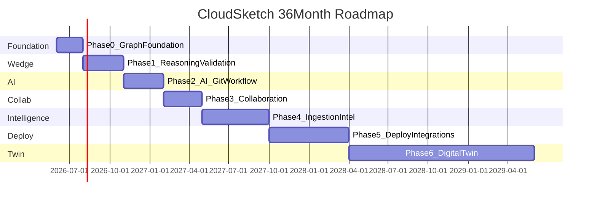
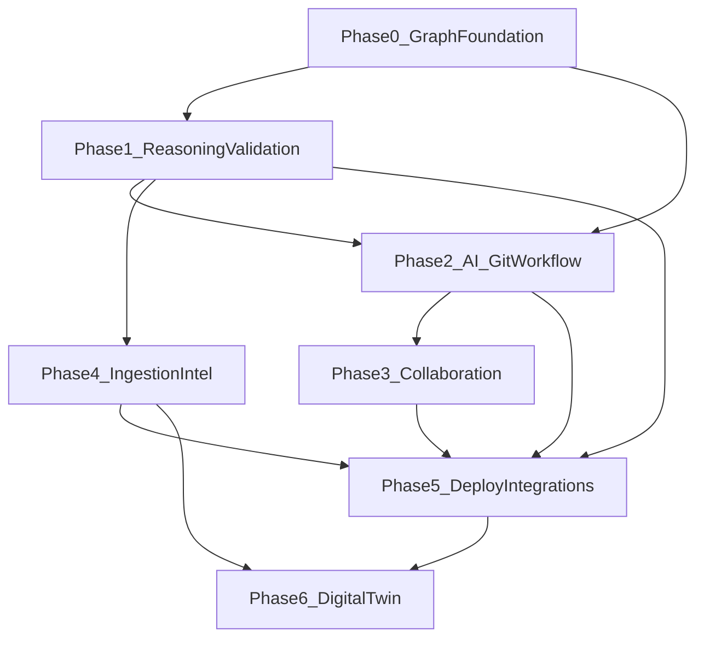

# CloudSketch Roadmap

*Last updated: June 2026 — 36-month horizon*

This roadmap translates the [CloudSketch Vision](./vision.md) into a phased execution plan. Strategic sequencing is informed by [grok-report.md](./grok-report.md): **reasoning + validation first**, AI second, collaboration third, partner-led deploy.

> **Note:** [business-plan.md](./business-plan.md) §7 (Product Strategy & Roadmap Alignment) reflects the previous phase ordering and will need a follow-up update to match this document.

---

## Guiding Principles

1. **Graph-first** — Every feature reads from and writes to canonical UGCP. Diagrams, Terraform, validation, and analysis are projections, never separate artifacts.
2. **Wedge before breadth** — Ship reasoning + validation (Phase 1) before production AI polish (Phase 2) or real-time collaboration (Phase 3).
3. **Git-first** — Terraform lives in repos. Export and import from Git; canvas is a view, not a trap.
4. **AWS depth before multi-cloud** — Prove on AWS 3-tier and serverless patterns before Azure/GCP.
5. **Integrate, don't build** — Partner with Infracost (cost), Terraform Cloud / Spacelift (deploy). Do not compete in Year 1–2.
6. **Ship usable slices** — Each phase delivers standalone value before the next layer.
7. **Human-in-the-loop** — AI generates and recommends; engineers retain full edit control.

---

## Phase Overview

| Phase | Months | Focus | Vision capabilities |
|-------|--------|-------|---------------------|
| **0: Graph Foundation** | 1–2 | UGCP v1, persistence, AWS depth, Git export | 2, 11 |
| **1: Reasoning + Validation Wedge** | 2–5 | Provenance, 30-rule validation, basic "why?" Q&A | 5, 6 |
| **2: AI + Git Workflow** | 5–8 | Production LLM, incremental merge, TF round-trip | 1, 11 |
| **3: Collaboration** | 8–11 | Async review first, then live sync, workspaces | 3 |
| **4: Ingestion + Intelligence** | 11–16 | Doc/TF import, failure sim, Infracost | 4, 7, 8, 9, 10 |
| **5: Deploy Integrations** | 16–22 | GitHub push, TFC/Spacelift handoff, drift via partners | 12 |
| **6: Digital Twin** | 22–36 | AWS inventory sync, design/deployed/runtime states | 13 |

---

## Current State (Baseline — Q2 2026)

| Area | CloudSketch | Brainboard (leader) | Gap |
|------|-------------|---------------------|-----|
| Visual canvas (xyflow) | ✅ Drag/drop, VPC → Subnet nesting | ✅ Full multi-cloud | Behind on resource library |
| AWS resource coverage | ⚠️ ~11 types | ✅ Comprehensive | 12–24 months behind |
| Connection validation | ✅ Rule-based (EC2 ↔ EBS, etc.) | ✅ | Parity on basics |
| Terraform generation | ✅ Client-side template evaluator | ✅ Real-time | Behind on modules, round-trip |
| Infrastructure graph (UGCP) | ⚠️ `parseUGCP.ts` normalization only | ✅ Mature | No provenance, no schema |
| AI-powered design | ⚠️ Mocked/Groq-ready API route | ✅ Production | Behind; not the wedge |
| Reasoning / provenance | ❌ | ❌ | **On time — nobody has this** |
| Validation engine | ❌ | ⚠️ Partial | **On time — ship first** |
| Collaboration | ❌ | ✅ Live cursors, teams | Behind |
| Cost intelligence | ❌ | Claims built-in | Integrate Infracost instead |
| Failure simulation | ❌ | ❌ | **On time — differentiated** |
| Deploy automation | ❌ | ⚠️ Partial | Partner, don't build |
| Digital twin | ❌ | ⚠️ Drift detection | Long-term |
| Auth & persistence | ⚠️ Clerk + MongoDB wired; localStorage projects | ✅ Enterprise | MongoDB persistence needed |

**Summary:** 12–24 months behind on table-stakes features. 0 months ahead on differentiated vision pieces — because nobody has built them yet.

---

## Phase 0: Graph Foundation (Months 1–2)

**Goal:** Make UGCP the reliable core with Git export — everything else depends on this.

**Maps to vision:** Capability 2 (Visual Design), 11 (TF Generation)

**Why this sequencing:** Validation and reasoning require a stable graph schema with provenance fields. Canvas must become a pure projection, not a parallel state model. Git export establishes developer trust from day one.

### Deliverables

#### 0.1 Canonical Infrastructure Graph (UGCP v1)

- [ ] Define and publish UGCP v1 schema (nodes, edges, metadata, constraints, provenance)
- [ ] Zod types in `src/models/ugcp/` with strict validation
- [ ] Bidirectional sync: canvas state ↔ UGCP graph via single write path in `useDiagramStore.ts`
- [ ] Graph versioning: snapshot on every meaningful change
- [ ] Graph diff utility (what changed between versions)
- [ ] Provenance fields on schema (`source`, `requirementRef`, `rationale`, `patternRef`, `promptRef`, `overrides`, `createdAt`, `createdBy`) — populated in Phase 1

#### 0.2 Persistence & Project Model

- [ ] Upgrade `useProjectStore.ts` from localStorage to MongoDB persistence
- [ ] Project CRUD (create, open, save, duplicate, delete)
- [ ] Auto-save with debounce (existing pattern) + conflict detection
- [ ] Project metadata (name, description, tags, owner)
- [ ] Export/import project as portable UGCP JSON

#### 0.3 AWS Resource Expansion (Tier 1 — 10 resources)

- [ ] ALB / NLB + Target Groups
- [ ] Lambda + API Gateway
- [ ] Route 53 + CloudFront
- [ ] NAT Gateway + Internet Gateway
- [ ] ElastiCache (Redis/Memcached)
- [ ] SQS + SNS
- [ ] CloudWatch (alarms, log groups)
- [ ] Secrets Manager / SSM Parameter Store
- [ ] Complete Terraform templates (`.tf.tmpl`) for all new resources
- [ ] Connection rules for new resource pairs

#### 0.4 Git Export MVP

- [ ] One-click export: `terraform/` directory as zip download
- [ ] GitHub PR export (create branch + push generated TF via GitHub API)
- [ ] Export includes `ugcp-graph.json` metadata alongside Terraform
- [ ] README in export explaining graph → TF mapping

#### 0.5 Quality & Developer Experience

- [ ] E2E tests: canvas → UGCP → Terraform pipeline
- [ ] Connection rule test suite per resource pair
- [ ] Error surfaces in UI (invalid connections, missing required fields)
- [ ] Performance baseline: 100+ node diagrams render and compile TF in <2s

### Technical touchpoints

| Module | Action |
|--------|--------|
| `src/models/ugcp/` | Create — schema types, Zod validators |
| `src/store/useDiagramStore.ts` | Refactor — single write path to UGCP |
| `src/store/useProjectStore.ts` | Extend — MongoDB persistence |
| `src/templates/aws/` | Add — 10 new `.tf.tmpl` files |
| `src/config/` | Extend — new resource schemas and connection rules |
| `src/lib/export/` | Create — Git zip + GitHub PR export |

### Integration partners

None in this phase.

### Exit criteria

A user designs a realistic 3-tier AWS app (VPC → subnets → EC2/RDS/ALB), saves to MongoDB, reloads it, exports valid Terraform to Git, with UGCP as the authoritative model.

### Success metrics

| Metric | Target |
|--------|--------|
| AWS resources supported | 21+ (11 existing + 10 new) |
| Terraform regen latency | <2s for 50-node diagram |
| Save reliability | 95%+ (no data loss on reload) |
| Git export usage | 50%+ of beta users export within first session |

### Risks & mitigations

| Risk | Mitigation |
|------|------------|
| Graph schema churn breaks downstream | Versioned UGCP schema, migration tooling, contract tests |
| Canvas ↔ graph sync bugs | Single write path; E2E tests on every PR |
| MongoDB migration from localStorage | Dual-write period; export backup before migration |

---

## Phase 1: Reasoning + Validation Wedge (Months 2–5)

**Goal:** Ship the differentiation — provenance-backed reasoning and 30-rule validation that makes CloudSketch sellable.

**Maps to vision:** Capability 5 (Reasoning Engine), 6 (Validation)

**Why this sequencing:** Grok-report identifies reasoning + validation as the strongest wedge. Brainboard has 70–80% overlap on visual→TF but nobody answers "why?" or offers design-time validation with remediation. This is the 90-day MVP.

### Deliverables

#### 1.1 Validation Engine

- [ ] Rule engine in `src/lib/validation/` with pluggable rule interface
- [ ] 15 security rules: public exposure, open SGs, unencrypted storage, excessive IAM, missing WAF, public S3, RDS without encryption, Lambda without VPC, missing secrets rotation, etc.
- [ ] 15 reliability rules: SPOF, missing redundancy, no backup, single-AZ DB, missing health checks, no auto-scaling, missing DLQ, no multi-AZ, missing CloudWatch alarms, etc.
- [ ] Severity scoring: critical / high / medium / low
- [ ] Remediation text per finding with AWS Well-Architected references
- [ ] "Fix it" actions: propose graph mutations (user approves before applying)
- [ ] Validation runs on every graph change (debounced) and on-demand

#### 1.2 Validation UI

- [ ] Validation panel in sidebar (filterable by severity, category)
- [ ] Findings anchored to nodes on canvas (highlight + click-to-navigate)
- [ ] Fix-it preview: show proposed graph change before applying
- [ ] Validation summary badge on toolbar (e.g., "3 critical, 5 high")
- [ ] Export validation report (Markdown/PDF) for architecture reviews

#### 1.3 Provenance Capture

- [ ] Auto-populate provenance on node create: `source: human`, `createdAt`, `createdBy`
- [ ] Provenance on AI-generated nodes (when AI ships in Phase 2): `source: ai`, `promptRef`, `rationale`
- [ ] Provenance on template-applied nodes: `source: template`, `patternRef`, `rationale`
- [ ] Override tracking: when user moves/edits a node, log `overrides` array with reason
- [ ] Provenance editor: user can manually set `rationale` and `requirementRef` on any node

#### 1.4 Reasoning MVP

- [ ] "Why?" panel: select a node, see provenance trace (source → requirement → pattern → rationale → overrides)
- [ ] Basic Q&A without full RAG: "Why does this resource exist?" answered from provenance fields
- [ ] "What depends on this?" from edge traversal
- [ ] "What would break if I remove this?" from reverse dependency traversal
- [ ] Reasoning API route: `POST /api/reasoning/why` with node ID → provenance trace

#### 1.5 Design Partner Program

- [ ] Recruit 10 design partner teams (Series A–C SaaS, 10–50 engineers, AWS + Terraform)
- [ ] Weekly 30-min feedback sessions
- [ ] Shared Slack/Discord channel for async feedback
- [ ] Success criteria: 8/10 partners active weekly; 5+ act on validation findings per session

### Technical touchpoints

| Module | Action |
|--------|--------|
| `src/lib/validation/` | Create — rule engine, 30 rules, severity scorer |
| `src/lib/validation/rules/` | Create — individual rule files (security/, reliability/) |
| `src/components/ValidationPanel.tsx` | Create — findings UI |
| `src/components/ReasoningPanel.tsx` | Create — "why?" trace UI |
| `src/app/api/validation/route.ts` | Create — run validation on graph |
| `src/app/api/reasoning/why/route.ts` | Create — provenance trace endpoint |
| `src/models/ugcp/provenance.ts` | Create — provenance types and helpers |
| `src/store/useDiagramStore.ts` | Extend — provenance capture on mutations |

### Integration partners

None in this phase. Open-source validation rule packs as community building block.

### Exit criteria

User designs a 3-tier AWS architecture, sees 5+ validation findings with remediation, fixes 2 via "fix it" actions, asks "why is RDS in a private subnet?" and receives a provenance-backed answer. 10 design partners onboarded with weekly feedback.

### Success metrics

| Metric | Target |
|--------|--------|
| Validation rules shipped | 30 (15 security + 15 reliability) |
| Rule accuracy (false positive rate) | <10% on standard 3-tier patterns |
| Design partners active weekly | 8/10 |
| Partners acting on validation findings | 50%+ per session |
| "Why?" queries answered usefully | 80%+ (partner thumbs-up) |

### Risks & mitigations

| Risk | Mitigation |
|------|------------|
| Validation false positives erode trust | Start conservative; tunable severity; partner feedback loop |
| Provenance feels like overhead to users | Auto-populate everything; manual edit optional; show value via "why?" |
| Design partners don't engage | Select teams with active architecture pain; free access; weekly cadence |
| Perceived as "just another diagram tool" | Lead GTM with validation; never lead with AI or canvas |

---

## Phase 2: AI + Git Workflow (Months 5–8)

**Goal:** Production AI that outputs structured UGCP with provenance, plus Terraform ↔ graph round-trip.

**Maps to vision:** Capability 1 (AI Design), 11 (TF Generation)

**Why this sequencing:** AI is table-stakes, not the wedge. Production AI after validation ensures AI-generated architectures are immediately validated. Git round-trip builds developer trust.

### Deliverables

#### 2.1 Production AI Architecture Generation

- [ ] Productionize `src/app/api/ai/prompt/route.ts` — Groq/OpenAI/Anthropic with structured output
- [ ] UGCP graph JSON output with schema validation (Zod)
- [ ] Prompt engineering for workload-aware architectures (traffic, data, compliance, region, HA)
- [ ] Requirement parsing: extract constraints from natural language (RTO/RPO, budget, region)
- [ ] Incremental generation: "add a cache layer" merges into existing graph, does not replace
- [ ] Auth + rate limiting + usage metering on AI endpoints
- [ ] AI provenance: every AI-generated node gets `source: ai`, `promptRef`, `rationale`

#### 2.2 AI → Canvas Placement

- [ ] Auto-layout engine (hierarchical: region → VPC → AZ → subnet → service)
- [ ] Collision-free positioning using existing subnet/VPC nesting logic
- [ ] Accept / reject / partially apply AI suggestions
- [ ] AI suggestion diff view: show what will be added/changed before applying
- [ ] Validation runs automatically on AI-generated graph before user accepts

#### 2.3 Git Workflow

- [ ] Terraform import: parse existing `.tf` files → UGCP graph (supported resources)
- [ ] TF ↔ graph round-trip: edit TF in code panel, changes reflect on canvas
- [ ] `terraform validate` on-demand in UI (server-side or WebAssembly)
- [ ] Git sync status indicator (graph in sync / drifted from last export)
- [ ] GitHub webhook: detect TF repo changes, offer to re-import

#### 2.4 Terraform Quality

- [ ] Module-aware generation (VPC module, ECS module, 3-tier reference)
- [ ] Variable/output extraction for environment parameterization
- [ ] Reference architecture: one-click 3-tier web app template with full TF module output
- [ ] TF formatting ( `terraform fmt` equivalent) on export

#### 2.5 Visual Design Enhancements

- [ ] Reusable architecture templates (3-tier web, serverless API, data lake)
- [ ] Logical grouping (tiers, environments) as first-class graph constructs
- [ ] Multi-region visual layout (region containers)
- [ ] Search/filter nodes by type, tag, or property

### Technical touchpoints

| Module | Action |
|--------|--------|
| `src/app/api/ai/prompt/route.ts` | Productionize — LLM integration, structured output |
| `src/lib/ai/parseUGCP.ts` | Extend — provenance injection, schema validation |
| `src/lib/ai/layout.ts` | Create — auto-layout engine |
| `src/lib/import/terraform.ts` | Create — TF → UGCP parser |
| `src/lib/export/git.ts` | Extend — round-trip sync, webhook handler |
| `src/components/AIConsole.tsx` | Extend — diff view, accept/reject, incremental prompts |

### Integration partners

LLM providers: Groq (primary), OpenAI, Anthropic (fallback).

### Exit criteria

User describes a system in natural language, receives a validated + provenance-tagged architecture on canvas, iterates via follow-up prompts, exports to Git, edits TF in repo, re-imports with changes reflected on canvas.

### Success metrics

| Metric | Target |
|--------|--------|
| AI-generated architectures accepted with <5 manual edits | 70%+ |
| AI-generated architectures passing validation without fixes | 60%+ |
| TF round-trip fidelity (supported resources) | 90%+ |
| `terraform validate` pass rate on export | 95%+ for 3-tier patterns |
| NPS from beta users | ≥40 |

### Risks & mitigations

| Risk | Mitigation |
|------|------------|
| AI generates unsafe architectures (public DB, open SGs) | Validation gate before accept; never auto-apply AI output |
| TF round-trip breaks graph integrity | Limit to supported resources; clear "partial import" warnings |
| AI API costs at scale | Rate limiting; usage metering; tier-based limits |
| AWS Kiro/MCP commoditizes AI diagrams | Differentiate on validation + provenance, not generation speed |

---

## Phase 3: Collaboration (Months 8–11)

**Goal:** Team workspaces and async collaboration first; graduate to live sync only when async patterns prove value.

**Maps to vision:** Capability 3 (Collaborative Editing)

**Why this sequencing:** Real-time CRDT is expensive and not the wedge. Async collaboration (comments, review mode, version history) delivers 80% of team value at 20% of engineering cost. Brainboard has live cursors, but CloudSketch differentiates on review + validation workflows.

### Deliverables

#### 3.1 Team Workspaces

- [ ] Organization → teams → projects hierarchy
- [ ] Role-based access control via Clerk organizations (viewer, editor, admin, approver)
- [ ] Invite flow (email + link)
- [ ] SSO (SAML/OIDC via Clerk enterprise)
- [ ] Shared project URLs with permission gates

#### 3.2 Async Collaboration (ship first)

- [ ] Comment threads anchored to nodes and edges
- [ ] Architecture review mode (read-only for reviewers, annotation layer)
- [ ] Full change history with blame/attribution
- [ ] Named versions ("v1.0", "pre-prod review", "DR update")
- [ ] Version compare (diff two versions on canvas)
- [ ] @mentions in comments with notifications

#### 3.3 Approval Workflows

- [ ] Submit for review → reviewer comments → approve / request changes
- [ ] Approved versions locked (edit requires new version)
- [ ] Audit log (who changed what, when) for compliance
- [ ] Validation must pass (zero critical findings) before approval allowed

#### 3.4 Live Collaboration (ship after async proves value)

- [ ] WebSocket or CRDT-based live sync (Yjs or Liveblocks on UGCP)
- [ ] Presence indicators and shared cursors on canvas
- [ ] Live node/edge locking to prevent edit conflicts
- [ ] <500ms sync latency target

#### 3.5 Branch/Fork Projects

- [ ] Fork project for environment variants (dev/staging/prod)
- [ ] Merge changes between branches with conflict resolution
- [ ] Environment-specific parameter overlays

### Technical touchpoints

| Module | Action |
|--------|--------|
| `src/store/useWorkspaceStore.ts` | Create — org/team/project hierarchy |
| `src/components/CommentThread.tsx` | Create — anchored comments |
| `src/components/ReviewMode.tsx` | Create — read-only review overlay |
| `src/lib/versioning/` | Create — snapshot, diff, blame |
| `src/lib/collaboration/` | Create — CRDT sync (Phase 3.4) |
| `src/app/api/workspaces/` | Create — CRUD, invites, permissions |

### Integration partners

Clerk (auth, orgs, SSO). Slack notifications for review requests (optional).

### Exit criteria

Two engineers collaborate on an architecture via comments and version history; a lead reviews, requests changes, and approves a version with zero critical validation findings. Live sync available for teams that need it.

### Success metrics

| Metric | Target |
|--------|--------|
| Teams with 2+ active members | 30%+ of paying teams |
| Review workflows completed | 10+ per month across partners |
| Async collaboration engagement | 3+ comments per reviewed architecture |
| Live sync latency (when shipped) | <500ms |
| Concurrent editors per session | 3+ |

### Risks & mitigations

| Risk | Mitigation |
|------|------------|
| CRDT complexity delays phase | Ship async first; live sync is additive, not blocking |
| Conflict resolution UX is confusing | Branch/fork model; clear merge UI; last-write-wins fallback |
| Enterprise SSO delays adoption | Clerk enterprise tier; SAML guide in docs |

---

## Phase 4: Ingestion + Intelligence (Months 11–16)

**Goal:** Import brownfield infrastructure, simulate failures, integrate cost via Infracost.

**Maps to vision:** Capabilities 4 (Ingestion), 7 (Cost), 8 (Capacity), 9 (Failure Sim), 10 (Optimization)

**Why this sequencing:** Ingestion unlocks brownfield customers (platform teams with existing infra). Failure simulation is the second major wedge. Cost via Infracost integration, not custom build.

### Deliverables

#### 4.1 Document & Code Ingestion

- [ ] Upload pipeline: PDF, DOCX, Markdown, Confluence HTML exports
- [ ] RFC / requirements parser → structured requirements linked to graph nodes
- [ ] Terraform importer → UGCP graph (`.tf`, `.tfstate`)
- [ ] CloudFormation / K8s manifest importer → UGCP graph
- [ ] AWS Resource Groups / inventory import
- [ ] Constraint extraction (compliance frameworks, naming standards, region locks)
- [ ] Organizational context store (allowed services, approved patterns, cost centers)
- [ ] Imported nodes get `source: import` provenance with file reference

#### 4.2 Failure Simulation & Resilience

- [ ] Failure scenario engine in `src/lib/simulation/`
- [ ] 5 standard scenarios: region down, DB failover, cache loss, AZ failure, 10x traffic
- [ ] Dependency graph traversal for blast-radius visualization
- [ ] Animated failure propagation on canvas (affected nodes highlight/red)
- [ ] RTO/RPO estimation per scenario based on architecture topology
- [ ] Resilience score and gap report
- [ ] Custom scenario builder (select node to fail, see propagation)

#### 4.3 Cost Intelligence (Infracost integration)

- [ ] Infracost API integration for per-resource cost estimates
- [ ] Cost overlay on canvas nodes (monthly estimate per resource)
- [ ] Architecture variant comparison ("Option A: $2,400/mo vs Option B: $1,800/mo")
- [ ] Cost driver breakdown (top 5 resources by spend)
- [ ] Do NOT build custom AWS Pricing API integration

#### 4.4 Scalability & Capacity (lightweight)

- [ ] Workload profile on project (RPS, concurrent users, data volume)
- [ ] Bottleneck identification across compute, network, DB, cache
- [ ] Auto-scaling and read-replica recommendations via validation rules
- [ ] Capacity saturation warnings

#### 4.5 Optimization Recommendations

- [ ] Recommendation engine building on validation findings + cost + failure gaps
- [ ] Tradeoff matrix per recommendation (cost vs availability vs complexity)
- [ ] One-click "apply recommendation" with graph preview
- [ ] Optimization history tracking

#### 4.6 Reasoning Engine (full)

- [ ] RAG over uploaded org documents + graph context for "why?" answers
- [ ] Alternative suggestions with tradeoff explanations
- [ ] Best-practice knowledge base (AWS Well-Architected, CIS benchmarks)
- [ ] "What if I used Aurora instead of RDS?" comparative reasoning

### Technical touchpoints

| Module | Action |
|--------|--------|
| `src/lib/ingestion/` | Create — parsers for TF, CFN, K8s, docs |
| `src/lib/simulation/` | Create — failure scenarios, blast radius |
| `src/lib/integrations/infracost.ts` | Create — API client, cost overlay |
| `src/components/FailureSimPanel.tsx` | Create — scenario picker, animation |
| `src/components/CostOverlay.tsx` | Create — per-node cost badges |
| `src/app/api/ingestion/route.ts` | Create — upload + parse pipeline |
| `src/app/api/simulation/route.ts` | Create — run failure scenario |

### Integration partners

- **Infracost** — cost estimates (API integration, not competitor)
- **AWS Resource Groups** — inventory import

### Exit criteria

User uploads an existing Terraform repo, gets a populated graph with provenance, runs a region-failure simulation seeing blast radius, compares two architecture variants with Infracost cost estimates, and applies an optimization recommendation.

### Success metrics

| Metric | Target |
|--------|--------|
| TF repos parsed correctly | 80%+ for supported resources |
| Failure scenarios per architecture | 5+ standard scenarios available |
| Cost estimate accuracy (via Infracost) | Within 15% of actual AWS bill |
| Ingestion → validation findings generated | 90%+ of imported repos |
| Optimization recommendations accepted | 30%+ |

### Risks & mitigations

| Risk | Mitigation |
|------|------------|
| TF import fails on complex modules | Start with flat resources; clear "partial import" UX; expand coverage iteratively |
| Failure simulation feels theoretical | Ground in real AWS failure modes; partner with SRE design partners for credibility |
| Infracost API changes or pricing | Abstraction layer; fallback to manual cost entry |
| Ingestion scope creep (every doc format) | Start with Markdown + TF; add PDF/Confluence based on partner demand |

---

## Phase 5: Deploy Integrations (Months 16–22)

**Goal:** Close the design → deploy loop via partners — not by building apply infrastructure.

**Maps to vision:** Capability 12 (Deployment Automation)

**Why this sequencing:** Spacelift ($51M Series C) and Terraform Cloud own deploy orchestration. CloudSketch becomes the **design brain** that pushes to Git and triggers plans via partners. Building apply runners is a startup killer before PMF.

### Deliverables

#### 5.1 Git-Native Deploy Workflow

- [ ] Push generated TF + UGCP metadata to GitHub/GitLab repo
- [ ] Branch-per-environment model (dev/staging/prod)
- [ ] Environment-specific variable overlays (`.tfvars` per environment)
- [ ] CI/CD template generation (GitHub Actions, GitLab CI) for `terraform plan` on PR
- [ ] Validation gate in CI: block merge if critical findings exist

#### 5.2 Terraform Cloud Integration

- [ ] Connect TFC workspace to CloudSketch project
- [ ] Trigger `terraform plan` from CloudSketch UI
- [ ] Display plan results (add/change/destroy) in CloudSketch with graph highlighting
- [ ] Link plan changes back to graph nodes
- [ ] Trigger apply via TFC (with explicit user confirmation)

#### 5.3 Spacelift Integration

- [ ] Connect Spacelift stack to CloudSketch project
- [ ] Trigger plan/apply via Spacelift API
- [ ] Display run results in CloudSketch
- [ ] Policy check results surfaced alongside validation findings

#### 5.4 Drift Visibility (via partners)

- [ ] Display drift status from TFC/Spacelift on canvas (planned / deployed / drifted)
- [ ] Drift diff: what changed in cloud vs graph design
- [ ] Do NOT build custom drift detection infrastructure

#### 5.5 Deployment Status Overlay

- [ ] Node status badges: planned | deploying | live | drifted | failed
- [ ] Deployment timeline on project dashboard
- [ ] Post-deploy validation: re-run rules against deployed state

### Out of scope (explicit)

- Custom `terraform apply` runners
- State backend management
- Policy-as-code engine (Sentinel, OPA)
- Multi-account deployment orchestration
- Cloud credential vault

### Technical touchpoints

| Module | Action |
|--------|--------|
| `src/lib/integrations/github.ts` | Create — push, PR, webhook |
| `src/lib/integrations/tfc.ts` | Create — workspace connect, plan/apply |
| `src/lib/integrations/spacelift.ts` | Create — stack connect, run trigger |
| `src/components/DeployPanel.tsx` | Create — plan results, status overlay |
| `src/app/api/deploy/` | Create — trigger plan/apply via partners |

### Integration partners

- **Terraform Cloud** — plan/apply/drift
- **Spacelift** — plan/apply/policy
- **GitHub / GitLab** — repo push, CI templates

### Exit criteria

User designs architecture, exports to GitHub, triggers TFC plan from CloudSketch, sees plan results with graph highlighting, applies via TFC, sees deployment status on canvas. Drift detected via TFC and displayed within 1 hour.

### Success metrics

| Metric | Target |
|--------|--------|
| End-to-end design → plan in CloudSketch | <30 min for standard 3-tier |
| Plan triggered from CloudSketch | 50%+ of deploy-tier users |
| Drift detected and displayed | Within 1 hour of occurrence |
| Deploy integration NPS | ≥50 |

### Risks & mitigations

| Risk | Mitigation |
|------|------------|
| Partner API changes break integration | Abstraction layer; monitor partner changelogs |
| Users expect built-in apply | Clear UX messaging: "CloudSketch designs, TFC deploys"; partner logos prominent |
| Git workflow complexity scares non-DevOps users | Guided setup wizard; templates with pre-configured CI |

---

## Phase 6: Digital Twin (Months 22–36)

**Goal:** CloudSketch reflects live production infrastructure with continuous drift detection and runtime intelligence.

**Maps to vision:** Capability 13 (Digital Twin)

**Why this sequencing:** Digital twin requires deploy loop (Phase 5), ingestion (Phase 4), and proven graph model (Phases 0–1). Marketing this before Phase 5 completes would erode engineer trust.

### Deliverables

#### 6.1 Living Graph (AWS)

- [ ] Continuous sync from AWS APIs (Config, Resource Groups Tagging, CloudTrail)
- [ ] Three-state model on every node: **design** | **deployed** | **runtime**
- [ ] Drift visualization: planned ↔ actual diff on canvas (color-coded)
- [ ] Orphan detection: resources in cloud not in design, and vice versa
- [ ] Sync scheduler with configurable refresh interval (5 min – 24 hr)

#### 6.2 Operational Intelligence

- [ ] Runtime metrics overlay (CPU, latency, error rate) via CloudWatch integration
- [ ] Cost actuals vs estimates (Infracost actuals or AWS Cost Explorer)
- [ ] Anomaly correlation with architecture topology
- [ ] Change impact prediction before applying graph mutations
- [ ] Compliance posture dashboard (continuous, not point-in-time)

#### 6.3 Change Lifecycle

- [ ] Design change → validation → Git push → TFC plan → apply → runtime sync (full loop)
- [ ] Change history linking design decisions to deployment outcomes
- [ ] Incident annotations on affected graph regions

#### 6.4 Multi-Cloud (only after AWS twin is proven)

- [ ] Azure resource library (compute, networking, storage core)
- [ ] GCP resource library (compute, networking, storage core)
- [ ] Cross-cloud connection modeling
- [ ] Provider-agnostic graph abstractions with provider-specific views

### Technical touchpoints

| Module | Action |
|--------|--------|
| `src/lib/sync/aws.ts` | Create — inventory sync, Config integration |
| `src/lib/sync/scheduler.ts` | Create — periodic refresh |
| `src/components/TwinOverlay.tsx` | Create — design/deployed/runtime visualization |
| `src/components/DriftPanel.tsx` | Create — drift diff, orphan detection |
| `src/app/api/sync/` | Create — trigger sync, webhook from AWS |

### Integration partners

- **AWS Config / Resource Groups** — inventory sync
- **CloudWatch** — runtime metrics
- **Infracost** — actual cost data
- **Datadog / PagerDuty** — incident correlation (optional)

### Exit criteria

CloudSketch reflects live production AWS infrastructure, highlights drift within 5 minutes, shows runtime metrics on canvas, and supports design changes that flow through validation → Git → TFC → redeployment → runtime sync.

### Success metrics

| Metric | Target |
|--------|--------|
| Inventory accuracy | 95%+ for supported resource types |
| Drift detection latency | <5 min |
| Full change lifecycle completion | <2 hours (design → deployed → synced) |
| Enterprise accounts using digital twin | 10+ |

### Risks & mitigations

| Risk | Mitigation |
|------|------------|
| AWS API rate limits at scale | Pagination, caching, incremental sync |
| Sync hell (graph ↔ cloud ↔ TF) | Strict three-state model; conflict resolution UX; never auto-overwrite design |
| Multi-cloud spreads engineering thin | Gate on AWS twin proven with 10+ enterprise accounts |
| Datadog/Cloudcraft bundles diagrams + observability | Differentiate on reasoning + design-time intelligence, not runtime monitoring |

---

## Cross-Cutting Workstreams

These run in parallel across all phases:

| Workstream | Starts | Deliverables |
|------------|--------|-------------|
| **Security & Compliance** | Phase 1 | SOC 2 prep, encryption at rest/transit, secrets management, pen testing |
| **Open Source** | Phase 1 | UGCP schema spec, validation rule packs, template library |
| **Design Partner Program** | Phase 1 | 10 teams, weekly feedback, conversion to paid |
| **Product Analytics** | Phase 0 | Event tracking, funnel analysis, feature adoption |
| **AI Quality Monitoring** | Phase 2 | AI output validation rate, acceptance rate, cost per generation |
| **API Platform** | Phase 3 | Public REST API for graph CRUD, webhooks, integrations |
| **Documentation** | Phase 0 | User guides, API docs, architecture pattern library |
| **Community** | Phase 2 | Template marketplace, public pattern sharing (opt-in) |
| **Integrations** | Phase 3+ | Jira, Linear, Slack, Confluence, PagerDuty |

---

## Quarterly Milestones

| Quarter | Product milestone | GTM / revenue signal |
|---------|-------------------|---------------------|
| **Q3 2026** | UGCP v1 + 30 validation rules + Git export | 5 design partners active |
| **Q4 2026** | Reasoning MVP + 21+ AWS resources | 10 design partners; first paid pilots |
| **Q1 2027** | Production AI + TF round-trip | PLG launch; Pro tier ($29/user/mo) |
| **Q2 2027** | Async collab + team workspaces | Team tier ($49/user/mo) revenue |
| **Q3 2027** | TF import + failure sim MVP | Business tier ($79/user/mo) |
| **Q4 2027** | Infracost live + doc ingestion | FinOps persona adoption |
| **Q1 2028** | TFC / Spacelift integration | Deploy handoff GA; high-ACV accounts |
| **Q2 2028** | Drift via partners + deploy status overlay | Expansion revenue from deploy tier |
| **Q3 2028** | AWS digital twin MVP | Enterprise tier ($60K+/yr) |
| **Q4 2028** | Runtime metrics + compliance dashboard | 10+ enterprise accounts |
| **Q1 2029** | Full change lifecycle (design → runtime) | $2M+ ARR trajectory |
| **Q2 2029** | Azure/GCP resource libraries (if AWS proven) | Multi-cloud enterprise expansion |

---

## Phase Dependencies

| Dependency | Reason |
|------------|--------|
| Phase 1 requires Phase 0 | Validation rules operate on UGCP schema; provenance fields defined in Phase 0 |
| Phase 2 requires Phase 0 + 1 | AI outputs UGCP with provenance; validation gates AI acceptance |
| Phase 4 failure sim requires Phase 1 | Dependency traversal uses graph edges validated in Phase 1 |
| Phase 5 requires Phase 2 + 1 | Git workflow for export; validation gate before deploy |
| Phase 6 requires Phase 5 | Digital twin needs deploy loop to compare design vs deployed |

---

## Immediate Next 90 Days

Wedge-first sprint overlapping Phase 0 and Phase 1:

### Days 1–30: Schema + first rules

1. Finalize UGCP v1 schema with provenance fields (`src/models/ugcp/`)
2. Refactor canvas to single write path (UGCP as authority)
3. Ship 10 validation rules (5 security + 5 reliability)
4. MongoDB project persistence (upgrade from localStorage)
5. Begin recruiting design partners (target: 5 signed by day 30)

### Days 31–60: Validation UI + Git export

6. Ship 20 more validation rules (total: 30)
7. Validation panel with findings anchored to canvas nodes
8. "Fix it" actions for top 10 rules
9. Git export MVP (zip download + GitHub PR)
10. Add 5 AWS resources (ALB, Lambda, NAT GW, Route 53, SQS)

### Days 61–90: Reasoning + partners

11. Provenance capture on all node create/edit mutations
12. "Why?" panel with provenance trace
13. Add 5 more AWS resources (CloudFront, ElastiCache, API GW, CloudWatch, Secrets Manager)
14. 10 design partners onboarded with weekly feedback cadence
15. E2E tests for canvas → UGCP → TF → validation pipeline

### Explicitly deferred past 90 days

- Production AI hardening (Phase 2)
- Real-time CRDT collaboration (Phase 3)
- Custom deployment apply infrastructure (never — partner only)
- Infracost / cost integration (Phase 4)
- Multi-cloud resources (Phase 6)

---

## Design Partner Program

### Target profile

- Series A–C SaaS company, 10–50 engineers
- Primary cloud: AWS
- Uses Terraform in production
- Feels diagram/IaC drift pain acutely
- Has a platform or DevOps function

### Program structure

| Element | Detail |
|---------|--------|
| Cohort size | 10 teams |
| Duration | 6 months (extend if converting) |
| Access | Free unlimited during program |
| Cadence | Weekly 30-min feedback call |
| Channel | Shared Slack/Discord for async |
| Commitment | 1 architect/engineer attends weekly; provides real architecture to validate |

### Success criteria

| Metric | Target |
|--------|--------|
| Partners active weekly | 8/10 |
| Partners acting on validation findings | 5+ per session |
| Partners exporting to Git | 50%+ weekly |
| Partners converting to paid at launch | 5/10 |
| NPS at program end | ≥40 |

### Kill / pivot triggers

| Signal | Threshold | Action |
|--------|-----------|--------|
| Partners ignore validation | <30% act on findings after 90 days | Reassess wedge; interview partners on why |
| Partners use as diagram export only | >70% export TF but never validate or ask "why?" | Pivot messaging or product focus |
| TF quality insufficient | >10 manual fixes per architecture | Pause Phase 2 AI; fix TF templates first |
| No partner converts to paid | 0/10 at 6 months | Reassess ICP, pricing, or core value prop |

---

## Risk Register

| Risk | Impact | Probability | Mitigation |
|------|--------|-------------|------------|
| **"Just another diagram tool"** perception | High | High | Lead with validation + reasoning; never lead GTM with AI or canvas |
| **Visual IaC cultural resistance** | High | Medium–High | Git-first from Phase 0; export always available; TF quality ≥95% validate pass |
| **Building too much, too fast** | High | High | Ruthless phase sequencing; 90-day wedge sprint; defer collab + deploy |
| **AI generates unsafe architectures** | High | Medium | Validation gate before accept; provenance tracking; human approval required |
| **Graph sync hell** (canvas ↔ UGCP ↔ TF ↔ cloud) | High | Medium | Single write path; versioned schema; three-state model; never auto-overwrite |
| **Incumbent bundling** (AWS Kiro, Datadog+Cloudcraft) | Medium | Medium–High | Differentiate on reasoning + design-time simulation, not diagrams |
| **Brainboard ships reasoning first** | High | Low–Medium | Speed to Phase 1 exit; provenance is architecturally hard to bolt on |
| **Enterprise sales before PLG proof** | Medium | High | Design partners → paid pilots → PLG → enterprise |
| **Real-time collaboration complexity** | Medium | Medium | Async first; CRDT only after async proves value |
| **Infracost expands into diagram layer** | Medium | Low | Deep integration partnership; co-marketing |

---

## Team Scaling (Suggested)

| Phase | Months | Core team |
|-------|--------|-----------|
| 0–1 | 1–5 | 2 full-stack, 1 infra/IaC specialist, 1 designer |
| 2 | 5–8 | +1 ML/AI engineer |
| 3 | 8–11 | +1 backend (collab/sync) |
| 4 | 11–16 | +1 backend (ingestion), 1 ML/AI engineer |
| 5 | 16–22 | +1 platform engineer, 1 DevOps |
| 6 | 22–36 | +2 SRE/data engineers, enterprise CS, solutions architect |

---

## Document Maintenance

### Quarterly review checklist

- [ ] Re-read [grok-report.md](./grok-report.md) competitive signals — any new entrant in reasoning/simulation?
- [ ] Check Brainboard, StackGen, AWS Kiro release notes for overlapping features
- [ ] Review design partner feedback — is the wedge landing?
- [ ] Validate phase exit criteria against actual metrics
- [ ] Update quarterly milestone table with actuals
- [ ] Assess kill/pivot triggers — any activated?
- [ ] Sync [business-plan.md](./business-plan.md) phase table if phases shifted

### Version history

| Version | Date | Changes |
|---------|------|---------|
| 2.0 | June 2026 | Full resequencing per grok-report: reasoning/validation first, partner-led deploy |
| 1.0 | June 2026 | Initial roadmap (AI → collab → reasoning sequencing) |

---

*This roadmap is a living document. Revisit quarterly against vision priorities, customer feedback, and competitive landscape.*